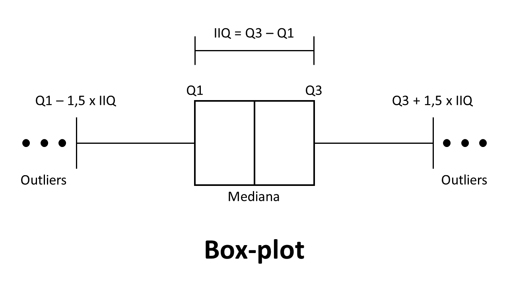

# 🏠 Análise de Dados Imobiliários com Python Pandas

<div align="center">


**Projeto completo de análise e tratamento de dados imobiliários utilizando Python Pandas**

</div>

---

## 📋 Índice

- [Sobre o Projeto](#-sobre-o-projeto)
- [Funcionalidades](#-funcionalidades)
- [Tecnologias Utilizadas](#%EF%B8%8F-tecnologias-utilizadas)
- [Dataset](#-dataset)
- [Pré-requisitos](#-pré-requisitos)
- [Instalação](#-instalação)
- [Estrutura do Projeto](#-estrutura-do-projeto)
- [Notebooks Principais](#-notebooks-principais)
- [Conteúdo Aprendido](#-conteúdo-aprendido)
- [Exemplos de Análises](#-exemplos-de-análises)
- [Visualizações](#-visualizações)
- [Técnicas Aplicadas](#-técnicas-aplicadas)
- [Executando o Projeto](#-executando-o-projeto)
- [Resultados](#-resultados)
- [Contribuindo](#-contribuindo)
- [Licença](#-licença)
- [Agradecimentos](#-agradecimentos)

---

## 📖 Sobre o Projeto

Este projeto foi desenvolvido como parte do curso **"Python Pandas: tratando e analisando dados"** da [Alura](https://www.alura.com.br/) e demonstra a aplicação prática de técnicas de **análise de dados** utilizando a biblioteca **Pandas** do Python.

O foco principal é a análise de um **dataset de imóveis para aluguel**, abrangendo todo o ciclo de análise de dados: desde a importação e limpeza até a análise exploratória, tratamento de valores ausentes, identificação de outliers e criação de visualizações.

### 🎯 Objetivos do Projeto

- 📊 Realizar análise exploratória completa de dados imobiliários
- 🧹 Aplicar técnicas de limpeza e tratamento de dados
- 📈 Criar visualizações informativas para insights de negócio
- 🔍 Identificar e tratar outliers e valores faltantes
- 💡 Gerar estatísticas descritivas e relatórios analíticos
- 🎓 Demonstrar proficiência em manipulação de dados com Pandas

---

## ✨ Funcionalidades

### Análise de Dados
- ✅ Importação e exportação de dados em múltiplos formatos (CSV, TXT, Excel)
- ✅ Análise exploratória de dados (EDA - Exploratory Data Analysis)
- ✅ Estatísticas descritivas completas (média, mediana, desvio padrão, quartis)
- ✅ Análise de distribuição de frequências
- ✅ Identificação de padrões e tendências no mercado imobiliário

### Tratamento de Dados
- ✅ Detecção e tratamento de dados faltantes (missing values)
- ✅ Identificação de outliers usando Box-Plot e IQR (Interquartile Range)
- ✅ Remoção de valores atípicos baseada em critérios estatísticos
- ✅ Criação de novas variáveis derivadas
- ✅ Filtragem e seleção de subconjuntos de dados

### Visualização
- ✅ Gráficos de distribuição (histogramas, box-plots)
- ✅ Gráficos de barras para análise de categorias
- ✅ Visualizações customizadas com Matplotlib
- ✅ Análise visual de outliers

### Agrupamentos e Agregações
- ✅ Agrupamento de dados por categorias (tipo de imóvel, bairro)
- ✅ Cálculo de estatísticas agregadas por grupo
- ✅ Análise comparativa entre diferentes segmentos

---

## 🛠️ Tecnologias Utilizadas

### Linguagem e Ambiente
- **[Python 3.8+](https://www.python.org/)** - Linguagem de programação
- **[Jupyter Notebook](https://jupyter.org/)** - Ambiente interativo de desenvolvimento
- **[Anaconda](https://www.anaconda.com/)** (opcional) - Distribuição Python para ciência de dados

### Bibliotecas Python

#### Análise de Dados
- **[Pandas 1.3+](https://pandas.pydata.org/)** - Manipulação e análise de dados estruturados
  - DataFrames e Series
  - Operações de limpeza e transformação
  - Agrupamentos e agregações
  - Merge, join e concatenação de datasets

#### Visualização
- **[Matplotlib 3.4+](https://matplotlib.org/)** - Criação de gráficos e visualizações
  - Gráficos de barras e histogramas
  - Box-plots para análise de outliers
  - Personalização de plots

#### Utilidades
- **[NumPy](https://numpy.org/)** - Operações numéricas (dependência do Pandas)

### Ferramentas de Desenvolvimento
- **[Visual Studio Code](https://code.visualstudio.com/)** - Editor de código (opcional)
- **[Git](https://git-scm.com/)** - Controle de versão

---

## 📊 Dataset

### Descrição do Dataset

O projeto utiliza um dataset real de **imóveis para aluguel** contendo informações sobre propriedades no Rio de Janeiro.

**Arquivo principal:** `dados/aluguel.csv`

### Estrutura dos Dados

| Coluna | Tipo | Descrição | Exemplo |
|--------|------|-----------|---------|
| `Tipo` | String | Tipo do imóvel | Apartamento, Casa, Quitinete |
| `Bairro` | String | Localização do imóvel | Copacabana, Botafogo, Centro |
| `Quartos` | Integer | Número de quartos | 1, 2, 3, 4 |
| `Vagas` | Integer | Vagas de garagem | 0, 1, 2, 3 |
| `Suites` | Integer | Número de suítes | 0, 1, 2 |
| `Area` | Integer | Área em metros quadrados | 40, 70, 100 |
| `Valor` | Float | Valor do aluguel (R$) | 1700, 2500, 5000 |
| `Condominio` | Float | Valor do condomínio (R$) | 500, 1000, 2000 |
| `IPTU` | Float | Valor do IPTU mensal (R$) | 60, 100, 200 |

### Estatísticas do Dataset

- **Total de registros:** ~32.960 imóveis
- **Imóveis residenciais:** ~21.826 registros
- **Dataset limpo (sem outliers):** ~19.832 registros
- **Tipos de imóveis:** 19 categorias diferentes
- **Principais tipos:** Apartamento (59%), Conjunto Comercial/Sala (21%), Casa (3%)

---

## 📋 Pré-requisitos

### Software Necessário

- **Python 3.8 ou superior** - [Download Python](https://www.python.org/downloads/)
- **Jupyter Notebook** - Para executar os notebooks interativos
- **pip** - Gerenciador de pacotes Python (incluído com Python)

### Conhecimentos Recomendados

- Conhecimento básico de Python
- Familiaridade com análise de dados
- Noções de estatística descritiva
- Experiência com Jupyter Notebook (desejável)

---

## 🚀 Instalação

### Opção 1: Usando pip (Recomendado)

```bash
# 1. Clone ou extraia o projeto
unzip pandas-processing-data-main.zip
cd pandas-processing-data-main

# 2. Crie um ambiente virtual (recomendado)
python -m venv venv

# Ative o ambiente virtual
# No Windows:
venv\Scripts\activate
# No Linux/Mac:
source venv/bin/activate

# 3. Instale as dependências
pip install pandas matplotlib jupyter notebook seaborn numpy

# 4. Inicie o Jupyter Notebook
jupyter notebook
```

### Opção 2: Usando Anaconda

```bash
# 1. Crie um ambiente conda
conda create -n pandas-analise python=3.8

# 2. Ative o ambiente
conda activate pandas-analise

# 3. Instale as dependências
conda install pandas matplotlib jupyter notebook seaborn numpy

# 4. Navegue até o diretório do projeto
cd pandas-processing-data-main

# 5. Inicie o Jupyter Notebook
jupyter notebook
```

### Opção 3: Google Colab (Sem instalação local)

Você também pode executar os notebooks diretamente no [Google Colab](https://colab.research.google.com/), fazendo upload dos arquivos `.ipynb` e `aluguel.csv`.

---

## 📁 Estrutura do Projeto

```
pandas-processing-data-main/
│
├── dados/                                      # Datasets utilizados
│   ├── aluguel.csv                            # Dataset original (32.960 registros)
│   ├── aluguel_residencial.csv                # Apenas imóveis residenciais
│   └── aluguel_residencial_sem_outliers.csv   # Dataset limpo
│
├── extras/                                     # Notebooks complementares
│   ├── Contadores.ipynb                       # Técnicas de contagem
│   ├── Criando Estruturas de Dados.ipynb      # Series e DataFrames
│   ├── Criando Faixas de Valor.ipynb          # Categorização de valores
│   ├── Formas de Seleção.ipynb                # Diferentes métodos de seleção
│   ├── Importando Dados.ipynb                 # Import/Export de dados
│   ├── Mais sobre Gráficos.ipynb              # Visualizações avançadas
│   ├── Métodos de Interpolação.ipynb          # Preenchimento de missing values
│   ├── Organizando DataFrames (Sort).ipynb    # Ordenação de dados
│   └── dados/                                 # Dados auxiliares
│       ├── aluguel.csv
│       └── aluguel.txt
│
├── Base de Dados.ipynb                        # ✅ Notebook 1: Introdução ao dataset
├── Seleções e Frequências.ipynb               # ✅ Notebook 2: Filtragem e análise
├── Tipos de Imóveis.ipynb                     # ✅ Notebook 3: Análise por tipo
├── Imóveis Residenciais.ipynb                 # ✅ Notebook 4: Foco em residências
├── Tratamento de Dados Faltantes.ipynb        # ✅ Notebook 5: Missing values
├── Criando Novas Variáveis.ipynb              # ✅ Notebook 6: Feature engineering
├── Criando Agrupamentos.ipynb                 # ✅ Notebook 7: GroupBy e agregações
├── Identificando e Removendo Outliers.ipynb   # ✅ Notebook 8: Limpeza de outliers
│
├── Box-Plot.png                               # Visualização de outliers
├── Seleções e Frequências (email chefe).txt   # Requisitos do projeto
└── README.md                                  # Documentação original
```

---

## 📓 Notebooks Principais

### 1. 📘 Base de Dados.ipynb
**Conceitos:** Introdução ao Jupyter e primeiros passos com Pandas
- Configuração do ambiente Jupyter
- Importação da biblioteca Pandas
- Leitura do dataset de imóveis
- Exploração inicial: `.head()`, `.shape`, `.info()`
- Compreensão da estrutura dos dados

### 2. 📗 Seleções e Frequências.ipynb
**Conceitos:** Filtragem de dados e análise de frequências
- Seleção de linhas e colunas
- Aplicação de filtros condicionais
- Análise de distribuição de frequências
- Resolução de requisitos do "email do chefe"
- Métodos `.loc[]`, `.iloc[]` e indexação booleana

### 3. 📙 Tipos de Imóveis.ipynb
**Conceitos:** Análise categórica e visualização
- Análise da distribuição de tipos de imóveis
- Criação de gráficos de barras
- Análise de proporções e percentuais
- Método `.value_counts()`

### 4. 📕 Imóveis Residenciais.ipynb
**Conceitos:** Segmentação e análise focada
- Filtragem de imóveis residenciais
- Análise específica de apartamentos, casas e quitinetes
- Comparação entre diferentes tipos residenciais
- Exportação de datasets filtrados

### 5. 📔 Tratamento de Dados Faltantes.ipynb
**Conceitos:** Data cleaning e imputação
- Identificação de valores nulos (`.isnull()`, `.isna()`)
- Visualização de missing data
- Técnicas de preenchimento: `.fillna()`, `.dropna()`
- Métodos de interpolação
- Decisões sobre remoção vs. imputação

### 6. 📒 Criando Novas Variáveis.ipynb
**Conceitos:** Feature engineering e transformação
- Criação de colunas calculadas
- Criação de variável "Valor Total" (Aluguel + Condomínio + IPTU)
- Criação de variável "Valor por m²"
- Categorização de variáveis contínuas
- Transformações matemáticas e lógicas

### 7. 📗 Criando Agrupamentos.ipynb
**Conceitos:** GroupBy e agregações
- Agrupamento por tipo de imóvel e bairro
- Cálculo de estatísticas por grupo (média, mediana, soma)
- Método `.groupby()`
- Agregações múltiplas com `.agg()`
- Análise comparativa entre grupos

### 8. 📘 Identificando e Removendo Outliers.ipynb
**Conceitos:** Detecção e tratamento de outliers
- Identificação de valores atípicos usando Box-Plot
- Cálculo de IQR (Interquartile Range)
- Definição de limites superior e inferior
- Remoção de outliers do dataset
- Comparação antes e depois da limpeza

---

## 📚 Conteúdo Aprendido

### Módulo 1: Conhecendo Jupyter
- ✅ Interface do Jupyter Notebook
- ✅ Células de código e markdown
- ✅ Atalhos de teclado essenciais
- ✅ Execução e organização de notebooks
- ✅ Modo de edição vs. modo de comando

### Módulo 2: Importando Dados
- ✅ Leitura de arquivos CSV com `pd.read_csv()`
- ✅ Configuração de separadores e encoding
- ✅ Exportação de DataFrames: `.to_csv()`, `.to_excel()`, `.to_json()`
- ✅ Leitura de diferentes formatos de arquivo
- ✅ Parâmetros de importação (header, index_col, dtype)

### Módulo 3: Series e Index
- ✅ Estrutura Series do Pandas
- ✅ Estrutura DataFrame
- ✅ Manipulação de índices
- ✅ Resetar e definir índices (`.reset_index()`, `.set_index()`)
- ✅ Diferenças entre Series e DataFrames

### Módulo 4: Filtrando Dados
- ✅ Seleção por posição: `.iloc[]`
- ✅ Seleção por rótulo: `.loc[]`
- ✅ Indexação booleana (boolean indexing)
- ✅ Filtros com múltiplas condições (`&`, `|`, `~`)
- ✅ Método `.query()` para filtros complexos
- ✅ Seleção de colunas específicas

### Módulo 5: Frequências de Imóveis
- ✅ Análise de distribuição com `.value_counts()`
- ✅ Criação de tabelas de frequência
- ✅ Cálculo de frequências relativas
- ✅ Frequências acumuladas
- ✅ Análise de categorias

### Módulo 6: Tratando Dados Faltantes
- ✅ Detecção de valores nulos: `.isnull()`, `.isna()`, `.notna()`
- ✅ Contagem de missing values
- ✅ Remoção de registros: `.dropna()`
- ✅ Preenchimento com valores: `.fillna()`
- ✅ Métodos de interpolação (linear, polinomial)
- ✅ Forward fill e backward fill

### Módulo 7: Novas Variáveis
- ✅ Criação de colunas calculadas
- ✅ Operações aritméticas entre colunas
- ✅ Aplicação de funções: `.apply()`, `.map()`
- ✅ Transformação de tipos de dados: `.astype()`
- ✅ Categorização com `pd.cut()` e `pd.qcut()`
- ✅ Variáveis dummy com `pd.get_dummies()`

### Módulo 8: Estatísticas Descritivas
- ✅ Método `.describe()` para resumo estatístico
- ✅ Medidas de tendência central: `.mean()`, `.median()`, `.mode()`
- ✅ Medidas de dispersão: `.std()`, `.var()`, `.min()`, `.max()`
- ✅ Quartis e percentis: `.quantile()`
- ✅ Correlação entre variáveis: `.corr()`

### Módulo 9: Removendo Outliers
- ✅ Box-Plot para visualização de outliers
- ✅ Cálculo do IQR (Q3 - Q1)
- ✅ Definição de limites (Q1 - 1.5×IQR, Q3 + 1.5×IQR)
- ✅ Filtragem de outliers
- ✅ Análise de impacto da remoção

---

## 🔍 Exemplos de Análises

### 1. Análise de Preços por Tipo de Imóvel

```python
# Agrupamento por tipo de imóvel
analise_tipo = df.groupby('Tipo')['Valor'].agg(['mean', 'median', 'min', 'max', 'count'])
print(analise_tipo)
```

**Insights:**
- Identificar tipos de imóveis mais caros
- Comparar preços médios por categoria
- Analisar variação de preços dentro de cada tipo

### 2. Identificação de Outliers

```python
# Cálculo do IQR para valores de aluguel
Q1 = df['Valor'].quantile(0.25)
Q3 = df['Valor'].quantile(0.75)
IQR = Q3 - Q1

# Limites
limite_inferior = Q1 - 1.5 * IQR
limite_superior = Q3 + 1.5 * IQR

# Filtrar outliers
df_limpo = df[(df['Valor'] >= limite_inferior) & (df['Valor'] <= limite_superior)]
```

**Resultado:**
- Removidos ~2.000 registros com valores atípicos
- Dataset mais representativo da realidade do mercado

### 3. Criação de Variáveis Derivadas

```python
# Criar coluna de valor total mensal
df['Valor_Total'] = df['Valor'] + df['Condominio'].fillna(0) + df['IPTU'].fillna(0)

# Criar coluna de valor por m²
df['Valor_m2'] = df['Valor'] / df['Area']

# Categorizar imóveis por tamanho
df['Categoria_Area'] = pd.cut(df['Area'], 
                               bins=[0, 50, 100, 200, 1000], 
                               labels=['Pequeno', 'Médio', 'Grande', 'Extra Grande'])
```

### 4. Análise por Bairro

```python
# Top 10 bairros mais caros
bairros_caros = df.groupby('Bairro')['Valor'].mean().sort_values(ascending=False).head(10)

# Visualização
bairros_caros.plot(kind='barh', figsize=(10, 6), title='Top 10 Bairros Mais Caros')
```

---

## 📈 Visualizações

### Box-Plot para Outliers



O projeto inclui visualizações como:

1. **Box-Plots** - Identificação visual de outliers
2. **Histogramas** - Distribuição de preços e áreas
3. **Gráficos de Barras** - Frequência de tipos de imóveis
4. **Gráficos de Dispersão** - Relação entre área e valor

### Exemplos de Código para Gráficos

```python
import matplotlib.pyplot as plt

# Box-plot de valores de aluguel
plt.figure(figsize=(10, 6))
plt.boxplot(df['Valor'])
plt.title('Distribuição de Valores de Aluguel')
plt.ylabel('Valor (R$)')
plt.show()

# Histograma de área dos imóveis
df['Area'].hist(bins=50, figsize=(12, 6), edgecolor='black')
plt.title('Distribuição de Área dos Imóveis')
plt.xlabel('Área (m²)')
plt.ylabel('Frequência')
plt.show()

# Gráfico de barras - Tipos de imóveis
df['Tipo'].value_counts().head(10).plot(kind='barh', figsize=(10, 6))
plt.title('10 Tipos de Imóveis Mais Comuns')
plt.xlabel('Quantidade')
plt.show()
```

---

## 🎯 Técnicas Aplicadas

### Data Wrangling
- **Seleção e Filtragem** - `.loc[]`, `.iloc[]`, `.query()`
- **Ordenação** - `.sort_values()`, `.sort_index()`
- **Remoção de duplicatas** - `.drop_duplicates()`
- **Renomeação de colunas** - `.rename()`

### Tratamento de Missing Data
- **Identificação** - `.isnull()`, `.sum()`, `.info()`
- **Remoção** - `.dropna(axis=0)` ou `.dropna(axis=1)`
- **Imputação** - `.fillna(value)`, `.fillna(method='ffill')`
- **Interpolação** - `.interpolate(method='linear')`

### Agregação e GroupBy
- **Agrupamento** - `.groupby(by=['Tipo', 'Bairro'])`
- **Agregação simples** - `.mean()`, `.sum()`, `.count()`
- **Agregação múltipla** - `.agg(['mean', 'median', 'std'])`
- **Transformação** - `.transform()`
- **Filtros em grupos** - `.filter()`

### Feature Engineering
- **Operações aritméticas** - Criação de variáveis calculadas
- **Binning** - `pd.cut()` para categorização
- **Encoding** - `pd.get_dummies()` para variáveis categóricas
- **Normalização** - Transformações escalares

### Análise Estatística
- **Estatísticas descritivas** - `.describe()`
- **Correlação** - `.corr()`, `.corrwith()`
- **Percentis** - `.quantile([0.25, 0.5, 0.75])`
- **Outliers** - Método IQR e Z-score

---

## 🏃 Executando o Projeto

### Passo a Passo

1. **Inicie o Jupyter Notebook**
   ```bash
   jupyter notebook
   ```

2. **Ordem Recomendada de Execução**

   Execute os notebooks na seguinte ordem para melhor compreensão:

   1. `Base de Dados.ipynb` - Introdução e exploração inicial
   2. `Seleções e Frequências.ipynb` - Filtragem básica
   3. `Tipos de Imóveis.ipynb` - Análise categórica
   4. `Imóveis Residenciais.ipynb` - Segmentação do dataset
   5. `Tratamento de Dados Faltantes.ipynb` - Limpeza de dados
   6. `Criando Novas Variáveis.ipynb` - Feature engineering
   7. `Criando Agrupamentos.ipynb` - Análise agregada
   8. `Identificando e Removendo Outliers.ipynb` - Refinamento final

3. **Notebooks Extras (Complementares)**

   Explore os notebooks na pasta `extras/` para conceitos adicionais e aprofundamento.

### Executando Células

No Jupyter Notebook:
- **Shift + Enter** - Executa a célula e avança
- **Ctrl + Enter** - Executa a célula atual
- **Alt + Enter** - Executa e insere nova célula abaixo
- **A** - Insere célula acima (modo comando)
- **B** - Insere célula abaixo (modo comando)

---

## 📊 Resultados

### Principais Descobertas

#### 1. Distribuição de Tipos de Imóveis
- **Apartamentos** representam ~59% do total de imóveis
- **Conjuntos Comerciais/Salas** representam ~21%
- **Casas** representam apenas ~3%

#### 2. Análise de Valores
- **Média de aluguel:** R$ 3.000 - R$ 4.000 (varia após limpeza)
- **Mediana de aluguel:** R$ 2.000 - R$ 2.500
- **Outliers identificados:** Imóveis com valores acima de R$ 15.000

#### 3. Missing Data
- **Condomínio:** ~30-40% de valores faltantes (comum em casas)
- **IPTU:** ~20-30% de valores faltantes
- **Estratégia:** Imputação com média/mediana ou remoção conforme caso

#### 4. Correlações
- Forte correlação positiva entre **Área** e **Valor**
- Correlação positiva entre **Quartos** e **Valor**
- Correlação positiva entre **Suítes** e **Valor**

#### 5. Outliers Removidos
- ~2.000 registros identificados como outliers
- Dataset final mais consistente e representativo
- Melhoria na qualidade das análises estatísticas

---

## 🎓 Conceitos de Pandas Abordados

### Estruturas de Dados
| Conceito | Descrição | Uso |
|----------|-----------|-----|
| **Series** | Array unidimensional rotulado | Uma única coluna de dados |
| **DataFrame** | Estrutura tabular bidimensional | Conjunto completo de dados |
| **Index** | Rótulos das linhas | Identificação e acesso a registros |

### Operações Fundamentais

```python
# Leitura de dados
df = pd.read_csv('aluguel.csv', sep=';')

# Exploração inicial
df.head()              # Primeiras linhas
df.tail()              # Últimas linhas
df.info()              # Informações do DataFrame
df.describe()          # Estatísticas descritivas
df.shape               # Dimensões (linhas, colunas)
df.columns             # Nome das colunas
df.dtypes              # Tipos de dados

# Seleção
df['Valor']            # Selecionar coluna
df[['Tipo', 'Valor']]  # Selecionar múltiplas colunas
df.loc[0:10]           # Selecionar por rótulo
df.iloc[0:10]          # Selecionar por posição

# Filtragem
df[df['Valor'] > 2000]                    # Filtro simples
df[(df['Quartos'] >= 2) & (df['Valor'] < 3000)]  # Múltiplas condições
df.query('Quartos >= 2 and Valor < 3000') # Usando query

# Ordenação
df.sort_values('Valor', ascending=False)  # Ordenar por coluna
df.sort_values(['Tipo', 'Valor'])         # Ordenar por múltiplas colunas

# Agrupamento
df.groupby('Tipo')['Valor'].mean()        # Média por grupo
df.groupby(['Tipo', 'Bairro']).agg({
    'Valor': ['mean', 'median', 'count']
})

# Missing data
df.isnull().sum()      # Contar valores nulos
df.dropna()            # Remover linhas com nulos
df.fillna(0)           # Preencher nulos com valor
df.fillna(df.mean())   # Preencher com média
```

---

## 🧪 Casos de Uso Práticos

### Requisitos do "Email do Chefe"

O arquivo `Seleções e Frequências (email chefe).txt` contém requisitos simulados:

1. ✅ **Selecionar apartamentos**
   ```python
   apartamentos = df[df['Tipo'] == 'Apartamento']
   ```

2. ✅ **Selecionar casas (todos os tipos)**
   ```python
   casas = df[df['Tipo'].isin(['Casa', 'Casa de Condomínio', 'Casa de Vila'])]
   ```

3. ✅ **Imóveis com área entre 60 e 100 m²**
   ```python
   imoveis_medio = df[(df['Area'] >= 60) & (df['Area'] <= 100)]
   ```

4. ✅ **Imóveis com 4+ quartos e aluguel < R$ 2.000**
   ```python
   imoveis_filtrados = df[(df['Quartos'] >= 4) & (df['Valor'] < 2000)]
   ```

---

## 📦 Dependências

### requirements.txt (Criar se necessário)

```txt
pandas>=1.3.0
matplotlib>=3.4.0
jupyter>=1.0.0
notebook>=6.4.0
numpy>=1.21.0
seaborn>=0.11.0
```

### Instalação das Dependências

```bash
pip install -r requirements.txt
```

---

## 🐛 Solução de Problemas

### Erro ao importar Pandas

**Problema:** `ModuleNotFoundError: No module named 'pandas'`

**Solução:**
```bash
pip install pandas
# ou
conda install pandas
```

### Erro de encoding ao ler CSV

**Problema:** `UnicodeDecodeError`

**Solução:**
```python
df = pd.read_csv('aluguel.csv', sep=';', encoding='utf-8')
# Ou tente
df = pd.read_csv('aluguel.csv', sep=';', encoding='latin-1')
```

### Jupyter Notebook não inicia

**Problema:** Comando `jupyter notebook` não encontrado

**Solução:**
```bash
# Instalar Jupyter
pip install jupyter notebook

# Ou com Anaconda
conda install jupyter notebook
```

### Gráficos não aparecem no notebook

**Problema:** Gráficos não são exibidos

**Solução:** Adicione no início do notebook:
```python
%matplotlib inline
import matplotlib.pyplot as plt
```

---

## 📈 Boas Práticas Aplicadas

### Organização de Código
- ✅ Separação lógica em notebooks temáticos
- ✅ Comentários explicativos em português
- ✅ Nomenclatura clara de variáveis
- ✅ Uso de markdown para documentação inline

### Análise de Dados
- ✅ Sempre explorar os dados antes de análises (`head()`, `info()`, `describe()`)
- ✅ Verificar tipos de dados e converter quando necessário
- ✅ Documentar decisões de tratamento de missing data
- ✅ Validar dados após transformações

### Performance
- ✅ Uso de operações vetorizadas do Pandas (evitar loops)
- ✅ Seleção apenas de colunas necessárias
- ✅ Uso eficiente de memória

---

## 🎯 Aplicações Práticas

Este projeto pode ser adaptado para:

- 📊 **Análise de mercado imobiliário** - Estudar tendências de preços
- 💼 **Business Intelligence** - Relatórios executivos de imóveis
- 🏢 **Imobiliárias** - Precificação e análise de portfólio
- 📈 **Investimentos** - Análise de oportunidades de investimento
- 🎓 **Educação** - Ensino de análise de dados e Pandas
- 🔬 **Pesquisa** - Estudos sobre mercado imobiliário

---

## 🔧 Comandos Úteis

### Gestão do Ambiente

```bash
# Listar pacotes instalados
pip list

# Verificar versão do Pandas
python -c "import pandas; print(pandas.__version__)"

# Atualizar Pandas
pip install --upgrade pandas

# Exportar ambiente
pip freeze > requirements.txt

# Importar ambiente
pip install -r requirements.txt
```

### Jupyter Notebook

```bash
# Iniciar em porta específica
jupyter notebook --port 8888

# Iniciar sem abrir navegador
jupyter notebook --no-browser

# Listar notebooks em execução
jupyter notebook list

# Converter notebook para script Python
jupyter nbconvert --to script notebook.ipynb

# Converter notebook para PDF
jupyter nbconvert --to pdf notebook.ipynb
```

---

## 📖 Recursos de Aprendizado

### Documentação Oficial

- **[Pandas Documentation](https://pandas.pydata.org/docs/)** - Documentação completa do Pandas
- **[Matplotlib Documentation](https://matplotlib.org/stable/contents.html)** - Guia de visualizações
- **[Jupyter Documentation](https://jupyter-notebook.readthedocs.io/)** - Manual do Jupyter
- **[NumPy Documentation](https://numpy.org/doc/)** - Fundamentos de computação numérica

### Cursos Recomendados

- **[Alura - Python Pandas: tratando e analisando dados](https://www.alura.com.br/)** - Curso base deste projeto
- **[Alura - Data Science: análise e visualização de dados](https://www.alura.com.br/)**
- **[Kaggle Learn - Pandas](https://www.kaggle.com/learn/pandas)** - Curso gratuito

### Livros

- "Python for Data Analysis" - Wes McKinney (criador do Pandas)
- "Data Wrangling with Python" - Jacqueline Kazil
- "Python Data Science Handbook" - Jake VanderPlas

### Comunidades

- [Stack Overflow - Pandas Tag](https://stackoverflow.com/questions/tagged/pandas)
- [Reddit - r/datascience](https://www.reddit.com/r/datascience/)
- [Pandas Community](https://pandas.pydata.org/community.html)

---

## 🎨 Extensões e Melhorias Possíveis

### Análises Adicionais
- [ ] Análise geoespacial com mapa dos bairros
- [ ] Previsão de preços usando Machine Learning (Scikit-learn)
- [ ] Análise de séries temporais (se houver dados de data)
- [ ] Clustering de imóveis similares (K-Means)
- [ ] Análise de correlação avançada (heatmaps)

### Visualizações
- [ ] Dashboards interativos com Plotly ou Dash
- [ ] Gráficos interativos com Bokeh
- [ ] Mapas de calor (heatmaps) de correlação
- [ ] Gráficos de dispersão 3D

### Ferramentas
- [ ] Integração com Streamlit para web app
- [ ] Automatização de relatórios com Papermill
- [ ] Exportação para Power BI ou Tableau
- [ ] API REST para consultas aos dados

### Banco de Dados
- [ ] Migração para SQLite/PostgreSQL
- [ ] Uso de SQLAlchemy para queries
- [ ] Cache de dados processados

---

## 🤝 Contribuindo

Contribuições são bem-vindas! Este é um projeto educacional e melhorias são sempre apreciadas.

### Como Contribuir

1. Fork este repositório
2. Crie uma branch para sua feature (`git checkout -b feature/NovaAnalise`)
3. Commit suas mudanças (`git commit -m 'Adiciona análise de correlação'`)
4. Push para a branch (`git push origin feature/NovaAnalise`)
5. Abra um Pull Request

### Ideias de Contribuição

- 📊 Adicionar novas análises e visualizações
- 📝 Melhorar documentação e comentários
- 🐛 Corrigir bugs ou problemas
- 🎨 Criar visualizações mais elaboradas
- 📚 Adicionar tutoriais e exemplos
- 🔧 Otimizar performance do código

---

## 📝 Notas Importantes

> 🎓 **Origem:** Este projeto foi desenvolvido com base no curso **"Python Pandas: tratando e analisando dados"** da **[Alura](https://www.alura.com.br/)**, uma das principais plataformas de ensino de tecnologia do Brasil.

> 📊 **Dataset Real:** Os dados utilizados são reais e representam imóveis para aluguel no Rio de Janeiro, proporcionando uma experiência prática de análise de dados.

> 🔍 **Foco Educacional:** O projeto tem fins educacionais e demonstra técnicas fundamentais de análise de dados que podem ser aplicadas em diversos contextos profissionais.

> ⚠️ **Encoding:** Alguns nomes de arquivos podem apresentar caracteres especiais devido a diferenças de encoding. Isso não afeta a execução dos notebooks.

---

## 📄 Licença

Este projeto está sob a licença MIT. Veja o arquivo `LICENSE` para mais detalhes.

---

## 👨‍💻 Autor

Desenvolvido como projeto de estudo do curso de Python Pandas da Alura.

---

## 🙏 Agradecimentos

- **[Alura](https://www.alura.com.br/)** - Pelo excelente curso de Python Pandas
- **Instrutores da Alura** - Pela didática e conteúdo de qualidade
- **Comunidade Pandas** - Pela biblioteca incrível e documentação
- **Wes McKinney** - Criador do Pandas
- **Comunidade Python** - Por todo o ecossistema de ciência de dados

---

## 📚 Próximos Passos

### Para Aprofundar seus Conhecimentos

1. **Machine Learning com Pandas**
   - Scikit-learn para modelos preditivos
   - Regressão linear para previsão de preços
   - Classificação de tipos de imóveis

2. **Visualização Avançada**
   - Seaborn para gráficos estatísticos
   - Plotly para dashboards interativos
   - Folium para mapas geográficos

3. **Big Data**
   - Dask para datasets grandes que não cabem na memória
   - PySpark para processamento distribuído
   - Vaex para exploração rápida de dados massivos

4. **Automação**
   - Scripts Python para automação de análises
   - Agendamento de relatórios com Airflow
   - Integração com APIs de dados imobiliários

---

## 🔗 Links Úteis

### Documentação e Tutoriais
- [10 Minutes to Pandas](https://pandas.pydata.org/docs/user_guide/10min.html) - Tutorial rápido oficial
- [Pandas Cheat Sheet](https://pandas.pydata.org/Pandas_Cheat_Sheet.pdf) - Referência rápida
- [Real Python - Pandas Tutorials](https://realpython.com/learning-paths/pandas-data-science/) - Tutoriais práticos

### Datasets para Prática
- [Kaggle Datasets](https://www.kaggle.com/datasets) - Milhares de datasets reais
- [UCI Machine Learning Repository](https://archive.ics.uci.edu/ml/) - Datasets acadêmicos
- [Data.gov.br](https://dados.gov.br/) - Dados abertos do governo brasileiro

### Ferramentas Complementares
- [Google Colab](https://colab.research.google.com/) - Jupyter na nuvem gratuito
- [Kaggle Notebooks](https://www.kaggle.com/code) - Notebooks compartilhados
- [Deepnote](https://deepnote.com/) - Ambiente colaborativo de notebooks

---

## 💡 Dicas de Estudo

### Para Iniciantes
1. ⭐ Execute os notebooks na ordem sugerida
2. ⭐ Experimente modificar os códigos e parâmetros
3. ⭐ Tente resolver os requisitos do "email do chefe" sozinho primeiro
4. ⭐ Crie seus próprios filtros e análises

### Para Intermediários
1. 🚀 Adicione novas visualizações aos notebooks existentes
2. 🚀 Crie análises de correlação mais profundas
3. 🚀 Experimente diferentes técnicas de tratamento de outliers
4. 🚀 Implemente validações estatísticas (testes de hipótese)

### Para Avançados
1. 💎 Integre modelos de Machine Learning (Regressão, Classificação)
2. 💎 Crie um dashboard interativo com Streamlit ou Dash
3. 💎 Otimize o código para grandes volumes de dados
4. 💎 Implemente pipeline de ETL completo

---

## 📊 Estatísticas do Projeto

| Métrica | Valor |
|---------|-------|
| **Notebooks principais** | 8 arquivos |
| **Notebooks extras** | 8 arquivos |
| **Total de notebooks** | 16 arquivos |
| **Datasets** | 3 arquivos CSV |
| **Registros no dataset original** | 32.960 imóveis |
| **Registros após limpeza** | ~19.832 imóveis |
| **Colunas analisadas** | 9 características |
| **Tipos de imóveis** | 19 categorias |
| **Visualizações criadas** | Múltiplos gráficos |

---

## 🏆 Competências Desenvolvidas

Ao completar este projeto, você desenvolveu habilidades em:

### Técnicas
- ✅ Manipulação de DataFrames e Series
- ✅ Limpeza e preparação de dados
- ✅ Análise exploratória de dados (EDA)
- ✅ Estatística descritiva
- ✅ Detecção e tratamento de outliers
- ✅ Feature engineering
- ✅ Visualização de dados

### Ferramentas
- ✅ Jupyter Notebook
- ✅ Pandas
- ✅ Matplotlib
- ✅ Python para Data Science

### Soft Skills
- ✅ Pensamento analítico
- ✅ Resolução de problemas
- ✅ Interpretação de dados
- ✅ Comunicação de insights

---

## 🎯 Casos de Sucesso

### Aplicações Reais do Conhecimento Adquirido

1. **Análise de Portfólio Imobiliário**
   - Avaliação de investimentos
   - Identificação de oportunidades
   - Análise de rentabilidade

2. **Relatórios Gerenciais**
   - Dashboards executivos
   - KPIs de mercado imobiliário
   - Análise de tendências

3. **Precificação Inteligente**
   - Modelo de preços baseado em características
   - Comparação com mercado
   - Sugestão de valores

4. **Due Diligence**
   - Análise de dados em aquisições
   - Validação de informações
   - Identificação de anomalias

---

## 🌟 Destaques do Projeto

### Pontos Fortes

- 📚 **Conteúdo Completo** - Cobertura abrangente de técnicas Pandas
- 🎯 **Prático e Aplicado** - Uso de dados reais do mercado
- 📊 **Visualizações Claras** - Gráficos informativos e bem estruturados
- 🧹 **Pipeline Completo** - Do dado bruto ao insight final
- 📖 **Bem Documentado** - Comentários e explicações em português
- 🔄 **Reproduzível** - Código organizado e reutilizável

### Diferenciais

- ✨ Dataset com mais de 32 mil registros reais
- ✨ Exemplos práticos de resolução de problemas de negócio
- ✨ Notebooks organizados por conceito e dificuldade
- ✨ Conteúdo extra para aprofundamento
- ✨ Baseado em curso reconhecido da Alura

---

## 📞 Suporte e Comunidade

### Precisa de Ajuda?

1. 📖 Consulte a documentação oficial do Pandas
2. 🔍 Pesquise no Stack Overflow com tag `pandas`
3. 💬 Participe de comunidades Python Brasil
4. 📧 Abra uma issue neste repositório

### Compartilhe seus Resultados

- Use a hashtag **#PandasBrasil** em redes sociais
- Compartilhe seus notebooks no Kaggle
- Contribua com a comunidade Python
- Ajude outros iniciantes

---

## 🎓 Certificação

Este projeto faz parte do curso **"Python Pandas: tratando e analisando dados"** oferecido pela **Alura**. 

Ao concluir o curso e este projeto, você estará apto a:
- Trabalhar com análise de dados profissionalmente
- Manipular datasets complexos com confiança
- Gerar insights valiosos a partir de dados brutos
- Criar visualizações impactantes
- Preparar dados para Machine Learning

---

## 📈 Roadmap de Evolução

### Fase 1: Fundamentos ✅
- [x] Importação e exploração de dados
- [x] Filtragem e seleção
- [x] Tratamento de missing data
- [x] Estatísticas descritivas

### Fase 2: Análise Avançada ✅
- [x] Criação de variáveis
- [x] Agrupamentos e agregações
- [x] Identificação de outliers
- [x] Visualizações

### Fase 3: Próximos Passos 🚀
- [ ] Machine Learning (Regressão Linear)
- [ ] Dashboard interativo
- [ ] API de consulta de dados
- [ ] Análise geoespacial

---

## 🔐 Segurança e Privacidade

> ⚠️ **Atenção:** Os dados utilizados neste projeto são para fins educacionais. Se você adaptar este código para uso profissional com dados reais:

- 🔒 Anonimize dados sensíveis (endereços, contatos)
- 🔒 Não compartilhe dados confidenciais publicamente
- 🔒 Siga a LGPD (Lei Geral de Proteção de Dados)
- 🔒 Obtenha consentimento para uso de dados pessoais

---

<div align="center">

## 🌟 Feito com Python e Pandas 🐼

**Desenvolvido como projeto de estudo do curso da Alura**

### ⭐ Se este projeto foi útil para você, considere dar uma estrela!

### 📚 Continue aprendendo e explorando o mundo da análise de dados!

---

**Python + Pandas = ❤️**

*"Dados são o novo petróleo, mas precisam ser refinados para gerar valor"*

</div>

---

## 📬 Contato

Para dúvidas, sugestões ou feedback sobre este projeto:

- 📧 Abra uma issue no repositório
- 💬 Participe das discussões
- 🐛 Reporte bugs encontrados
- 💡 Sugira melhorias

---

## 🏅 Conquistas do Projeto

- ✅ Análise completa de +32 mil registros imobiliários
- ✅ Implementação de 16 notebooks educacionais
- ✅ Tratamento de dados faltantes em múltiplas colunas
- ✅ Identificação e remoção de ~2 mil outliers
- ✅ Criação de variáveis derivadas para análise
- ✅ Geração de insights acionáveis sobre mercado imobiliário
- ✅ Pipeline completo de análise de dados reproduzível

---

**Última atualização:** Abril 2026
**Versão:** 1.0.0
**Status:** ✅ Completo e funcional
